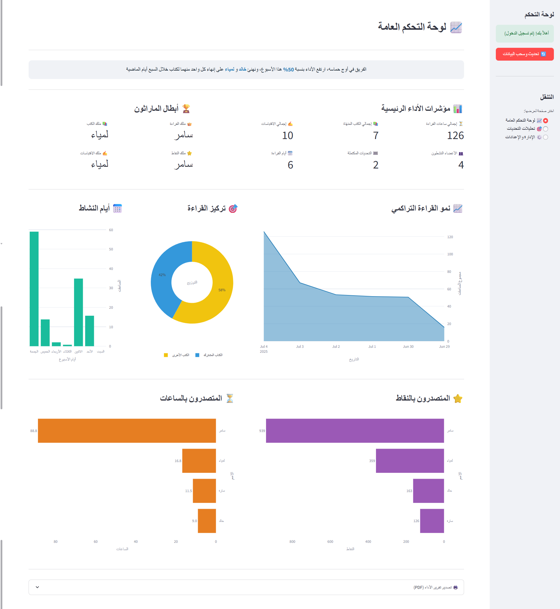
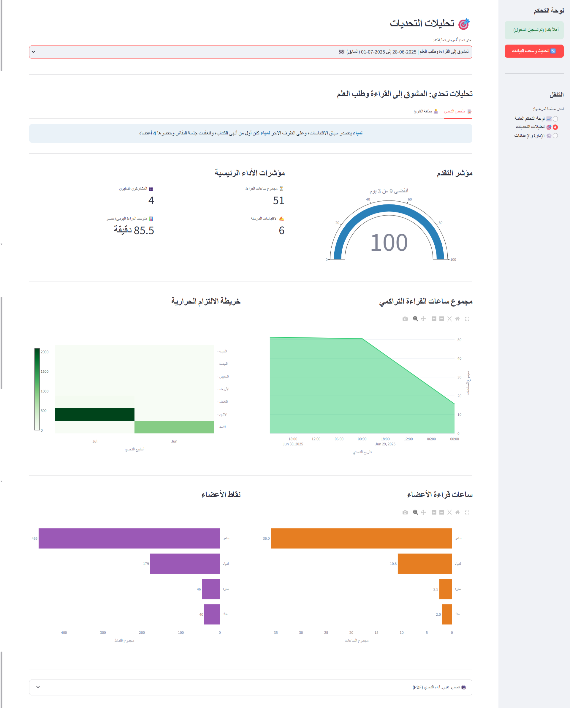
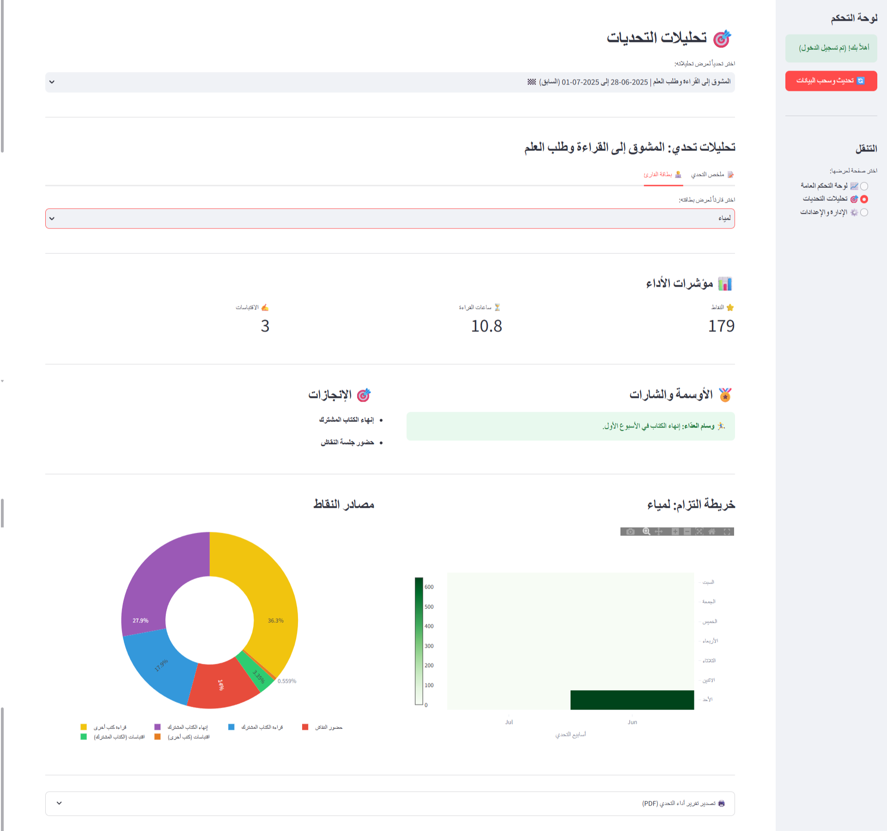
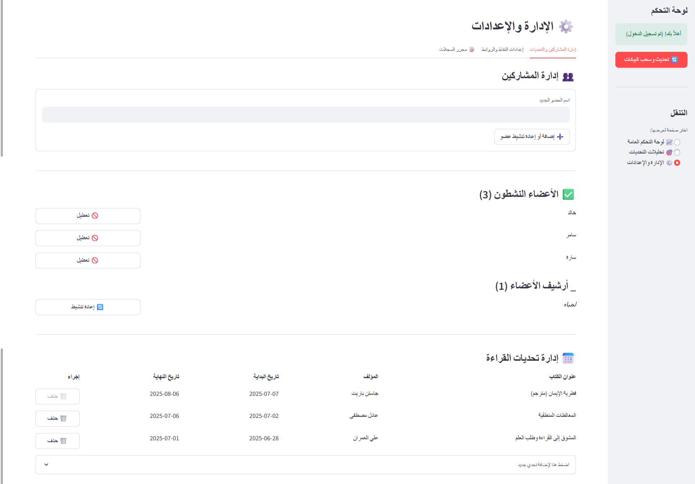
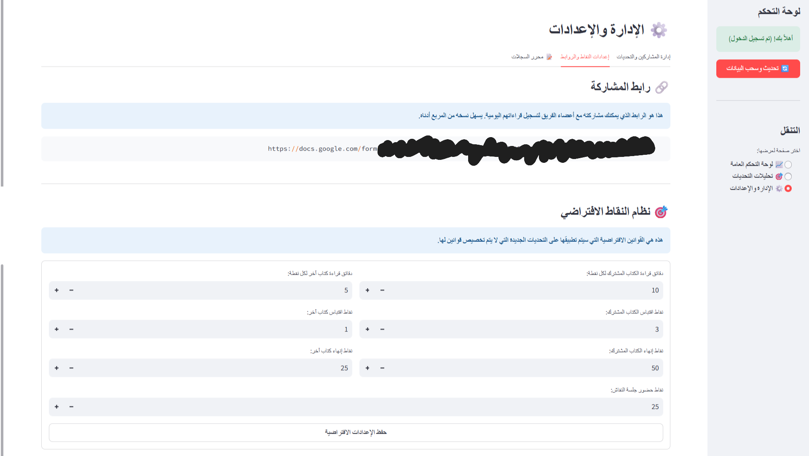
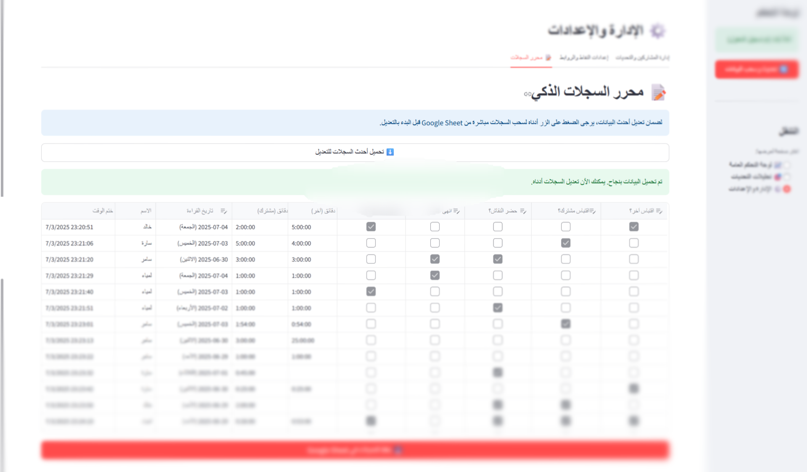

# 🏃‍♂️ ماراثون القراءة - النسخة السحابية

**منصة تفاعلية لإدارة سباقات القراءة الجماعية مع نظام نقاط ذكي وتحليلات شاملة**

---

## 🔄 الفرق بين النسخ: محلية vs سحابية

### 🏠 **النسخة المحلية (v1.0)**
- **المستودع:** [Reading-Tracker-Dashboard](https://github.com/Ahmad-Nayfeh/Reading-Tracker-Dashboard)
- **الاستخدام:** فردي أو مجموعات صغيرة على جهاز واحد
- **قاعدة البيانات:** SQLite محلي
- **الأداء:** بطيء نسبياً
- **الإعداد:** يتطلّب تثبيت محلي

### ☁️ **النسخة السحابية (v2.0) - هذا المستودع**
- **الاستخدام:** مجموعات كبيرة، متاح على الإنترنت
- **قاعدة البيانات:** Firebase Firestore السحابي
- **الأداء:** سريع
- **الإعداد:** استخدام مباشر عبر الإنترنت
- **المميزات:** وصول من أي مكان، إدارة مركزية

---

## 🎯 عن المشروع

**ماراثون القراءة** هو منصة تفاعلية تحول القراءة من نشاط فردي إلى تجربة جماعية مليئة بالحماس والتنافس الإيجابي. المنصة تدير سباقات القراءة بين الأصدقاء والمجموعات مع نظام نقاط ذكي يوازن بين القراءة الجماعية المنظمة والقراءة الفردية الحرة.

---

## ✨ المميزات الرئيسية

### 🎮 **نظام النقاط الذكي**
- **مسار الكتاب المشترك:** نقاط عالية + مكافآت النقاش
- **مسار الكتاب الحر:** نقاط متضاعفة حسب وقت القراءة
- **تشجيع الاقتباسات:** نقاط إضافية للمشاركة العميقة
- **منع الثغرات:** حد أدنى 3 ساعات للكتب الحرة

### 📊 **تحليلات شاملة**
- لوحة التحكم العامة مع إحصائيات كلية وقائمة الصدارة
- تحليلات مخصصة لكل ماراثون
- بطاقات القراء مع ملخص مفصل للإنجازات
- رسوم بيانية تفاعلية

### 🛠️ **إدارة متقدمة**
- إدارة شاملة للسجلات والأعضاء والتحديات
- نظام نقاط مرن قابل للتخصيص
- تقارير PDF احترافية باللغة العربية

---

## 🌐 الوصول للتطبيق

التطبيق متاح الآن على الإنترنت! لا حاجة لتثبيت أي شيء.

---

## 🖥️ صفحات التطبيق

### 1. لوحة التحكم العامة

### 2. تحليلات التحديات: ملخّص التحدي

### 3. تحليلات التحدّيات: بطاقة القارئ

### 4. الإدارة والإعدادات: إدارة المشاركين والتحدّيات

### 5. الإدارة والإعدادات: إعدادات النقاط والروابط

### 6. الإدارة والإعدادات: محرر السجلات

### 7. عن التطبيق

---

## 🛠️ التقنيات المستخدمة

- **🐍 Python 3.9+** - لغة البرمجة الأساسية
- **🌟 Streamlit** - إطار عمل الواجهات التفاعلية
- **🔥 Firebase Firestore** - قاعدة البيانات السحابية
- **📊 Plotly** - الرسوم البيانية التفاعلية
- **🐼 Pandas** - معالجة وتحليل البيانات
- **🔐 Google OAuth2** - نظام المصادقة الآمن
- **📄 FPDF2** - تصدير التقارير PDF

---

## 🤝 المساهمة والدعم

### 🐛 **الإبلاغ عن الأخطاء**
إذا واجهت أي مشكلة، يرجى [إنشاء issue](https://github.com/Ahmad-Nayfeh/Reading-Tracker-Dashboard-Cloud/issues).

---

## 📞 التواصل

---

**صُنع بـ ❤️ لمحبي القراءة**

