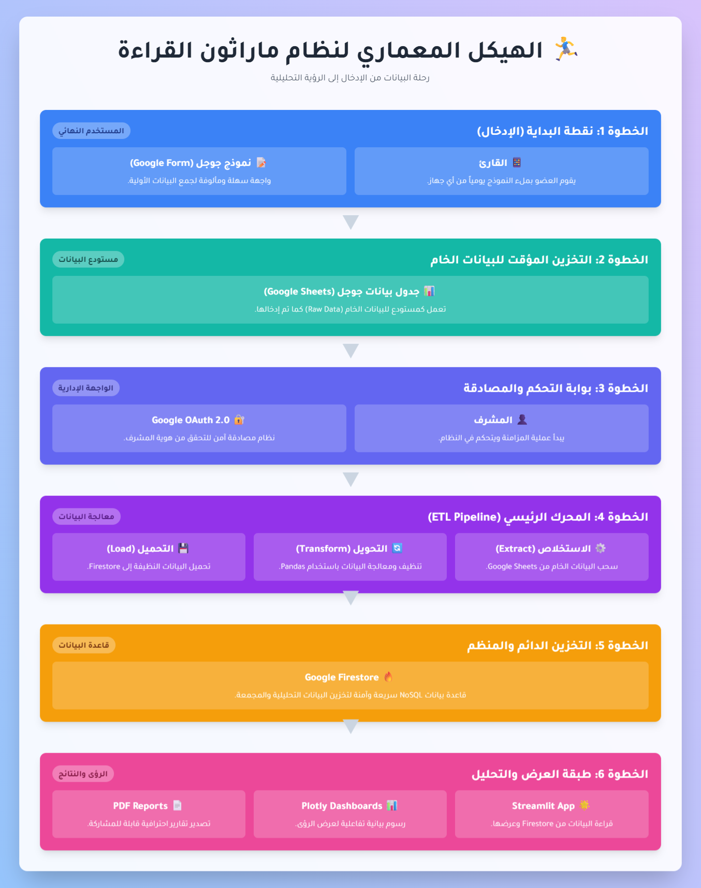

# 🏃‍♂️ ماراثون القراءة - النسخة السحابية

**منصة تفاعلية لإدارة سباقات القراءة الجماعية مع نظام نقاط ذكي وتحليلات شاملة**

---

## 📋 جدول المحتويات

- [🔄 الفرق بين النسخ: محلية vs سحابية](#-الفرق-بين-النسخ-محلية-vs-سحابية)
- [🎯 عن المشروع](#-عن-المشروع)
- [✨ المميزات الرئيسية](#-المميزات-الرئيسية)
- [⚙️ كيف يعمل؟](#-كيف-يعمل)
- [🖥️ صفحات التطبيق](#-صفحات-التطبيق)
- [🧠 فلسفة التحفيز الذكي](#-فلسفة-التحفيز-الذكي)
- [🏆 نظام النقاط والأوسمة](#-نظام-النقاط-والأوسمة)
- [📊 أدوات التحليل والمتابعة](#-أدوات-التحليل-والمتابعة)
- [🛠️ التقنيات المستخدمة](#-التقنيات-المستخدمة)
- [🚀 البدء السريع](#-البدء-السريع)
- [🤝 المساهمة والدعم](#-المساهمة-والدعم)
- [📞 التواصل](#-التواصل)

---

## 🔄 الفرق بين النسخ: محلية vs سحابية

### 🏠 **النسخة المحلية (v1.0)**
- **المستودع:** [Reading-Tracker-Dashboard](https://github.com/Ahmad-Nayfeh/Reading-Tracker-Dashboard)
- **الاستخدام:** غير متاح على الانترنت
- **قاعدة البيانات:** SQLite محلي
- **الأداء:** بطيء نسبياً
- **الواجهة:** بسيطة جدا
- **الإعداد:** يتطلّب تثبيت محلي

### ☁️ **النسخة السحابية (v2.0) - هذا المستودع**
- **الاستخدام:** متاح على الإنترنت
- **قاعدة البيانات:** Firebase Firestore السحابي
- **الأداء:** سريع وفعال
- **الواجهة:** تطور كبير في عرض لوحات التحكم وصفحات التطبيق
- **الإعداد:** استخدام مباشر عبر الإنترنت

---

## 🎯 عن المشروع

**ماراثون القراءة** هو منصة تفاعلية تحول القراءة من نشاط فردي إلى تجربة جماعية مليئة بالحماس والتنافس الإيجابي. يواجه مشرفو المجموعات القرائية تحديات مستمرة في متابعة التزام الأعضاء وتحفيزهم وتوفير بيانات قابلة للتحليل. 

هذا التطبيق يأتي كحل متكامل لهذه التحديات، حيث يوفر نظام نقاط ذكي يوازن بين القراءة الجماعية المنظمة والحرية الفردية، مع أدوات إدارية وتحليلية قوية تساعد المشرفين على إدارة المجموعات بكفاءة عالية.

---

## ✨ المميزات الرئيسية

### 🎮 **نظام تحفيز ونقاط ذكي**
- **منطق مرن للقراءة:** يتيح للأعضاء الاختيار بين قراءة الكتاب المشترك أو كتبهم الخاصة، مع نظام نقاط يكافئ كلاً من الالتزام الجماعي والاستمرارية الفردية
- **تحفيز التفاعل:** نقاط إضافية للمشاركة بالاقتباسات وحضور جلسات النقاش لتنشيط المجموعة
- **نظام الأوسمة والشارات:** يكافئ إنجازات معينة مثل الاستمرارية وسرعة الإنجاز

### 📊 **تحليلات بيانات قوية**
- **لوحة تحكم عامة:** توفر مؤشرات أداء رئيسية (KPIs) ولوحة شرف للأبطال لرؤية شاملة لأداء المجموعة
- **تحليلات مفصلة للتحديات:** تسمح بتقييم أداء كل تحدي على حدة
- **بطاقة أداء شخصية:** ملف تفصيلي لكل قارئ يوضح إنجازاته، مصادر نقاطه، وعاداته القرائية
- **رسوم بيانية تفاعلية:** تعرض البيانات بطريقة بصرية جذابة وسهلة الفهم

### 🛠️ **إدارة شاملة للمشرف**
- **إدارة مرنة للأعضاء:** إضافة، وأرشفة (تعطيل) الأعضاء مع تحديث تلقائي لنموذج التسجيل
- **تخطيط التحديات:** إنشاء تحديات مستقبلية بنظام نقاط افتراضي أو مخصص بالكامل
- **محرر السجلات الذكي:** أداة قوية لتصحيح وتعديل أي سجل قراءة موجود لضمان دقة البيانات

### 📄 **تقارير احترافية**
- **تصدير تقارير PDF:** إنشاء ومشاركة 3 أنواع من التقارير المفصلة (تقرير عام، تقرير تحدي، تقرير قارئ) بنقرة زر
- **تصميم عربي أنيق:** تقارير مصممة خصيصاً باللغة العربية مع دعم كامل للخطوط العربية

 

**شاهد أمثلة على التقارير التي يمكنك إنشاؤها:**

| نوع التقرير | رابط المثال |
| :--- | :---: |
| **📈 التقرير العام** | [اضغط هنا للمشاهدة](./reports/dashboard_report.pdf) |
| **🎯 تقرير التحدي** | [اضغط هنا للمشاهدة](./reports/challenge_report.pdf) |
| **🧑‍💻 تقرير القارئ** | [اضغط هنا للمشاهدة](./reports/reader_report.pdf) |

---

## ⚙️ كيف يعمل؟

آلية عمل التطبيق بسيطة ومباشرة، مصممة لتكون سهلة على المشرف والأعضاء.

### للمشرف (إعداد لمرة واحدة):

1. **تسجيل الدخول:** يسجل دخوله عبر حساب جوجل
2. **إنشاء تلقائي:** يقوم التطبيق تلقائياً بإنشاء جدول بيانات (Sheet) ونموذج تسجيل (Form) في حسابه الخاص
3. **مشاركة الرابط:** يشارك رابط نموذج التسجيل مع أعضاء المجموعة

### للأعضاء (العملية اليومية):

- **تسجيل القراءة:** يقوم كل عضو بملء النموذج يومياً لتسجيل مدة قراءته وإنجازاته

### للتطبيق (عند الحاجة):

- **تحديث البيانات:** يقوم المشرف بفتح التطبيق والضغط على زر "🔄 تحديث وسحب البيانات"
- **معالجة فورية:** يقوم التطبيق بسحب آخر البيانات من Google Sheet، معالجتها، وتحديث جميع التحليلات والرسوم البيانية فوراً

---

## 🏗️ الهيكل المعماري للنظام

نظرة شاملة على كيفية ترابط مكونات النظام لتقديم تجربة سلسة ومتكاملة. اضغط على الصورة أدناه لعرض النسخة التفاعلية الكاملة.

---

## 🖥️ صفحات التطبيق

### 1. لوحة التحكم العامة

**الوصف:** نظرة شاملة على أداء جميع المشاركين في كل التحديات، مع مؤشرات الأداء الرئيسية ولوحة شرف الأبطال.

### 2. تحليلات التحديات: ملخّص التحدي

**الوصف:** تحليلات مفصلة للتحدي المحدد حالياً، مع رسوم بيانية توضح توزيع القراءة والإنجازات.

### 3. تحليلات التحدّيات: بطاقة القارئ

**الوصف:** ملف تفصيلي لكل قارئ مع إحصائياته وأوسمته ومصادر نقاطه.

### 4. الإدارة والإعدادات

**الوصف:** إضافة وأرشفة الأعضاء، وإنشاء وإدارة التحديات بسهولة. تعديل نظام النقاط الافتراضي والحصول على رابط نموذج التسجيل. تعديل أي سجل قراءة سابق لضمان دقة البيانات.

### 5. عن التطبيق

**الوصف:** دليل شامل لكل ميزات التطبيق وفلسفته.

---

## 🧠 فلسفة التحفيز الذكي

تم تصميم نظام النقاط بعناية فائقة لمعالجة التحديات الجوهرية التي تواجه المجموعات القرائية، وتحقيق توازن دقيق بين الالتزام الجماعي والحرية الفردية.

### حل لمشكلة "الكتاب الإجباري"

- **حرية الاختيار:** يتيح النظام للقارئ حرية الاختيار بين قراءة الكتاب المشترك أو كتبه الخاصة
- **التحفيز على الالتزام:** نقاط أعلى عند إنهاء الكتاب المشترك لتشجيع المشاركة الجماعية
- **مكافحة الانقطاع:** نقاط أعلى على وقت القراءة للكتب الأخرى لضمان استمرارية القراءة

### تحفيز التفاعل عبر "الاقتباسات"

إرسال اقتباس من كتاب يمنح نقاطاً إضافية، مما يحول مجموعة التواصل إلى مساحة تفاعلية وحيوية لتبادل الأفكار.

### تتويج التجربة بـ "جلسة النقاش"

حضور جلسة النقاش في نهاية كل تحدي يمنح دفعة كبيرة من النقاط، مما يحول التجربة من مجرد قراءة صامتة إلى حوار فكري مثمر.

### الهدف الأسمى من النقاط

الفائز في كل تحدي (صاحب أعلى نقاط) يحصل على شرف اختيار الكتاب المشترك للتحدي القادم، مما يضيف بعداً استراتيجياً وممتعاً للمنافسة.

---

## 🏆 نظام النقاط والأوسمة

### نظام النقاط المرن

- **نظام افتراضي:** يمكن تعديله ليناسب طبيعة مجموعتك
- **نظام مخصص:** إمكانية وضع نظام نقاط مختلف لكل تحدي على حدة

### الأوسمة والشارات المتاحة

- **✍️ وسام الفيلسوف:** يُمنح للعضو الذي يشارك بأكثر من 10 اقتباسات
- **🏃‍♂️ وسام العدّاء:** يُمنح للعضو الذي ينهي الكتاب المشترك خلال 7 أيام أو أقل
- **💯 وسام المثابرة:** يُمنح للعضو الذي يقرأ لسبعة أيام متتالية أو أكثر

---

## 📊 أدوات التحليل والمتابعة

### لوحة التحكم العامة

- **مؤشرات الأداء الرئيسية:** إجمالي ساعات القراءة، الكتب المنهاة، الاقتباسات، الأعضاء النشطون، وغيرها
- **لوحة شرف الأبطال:** تحتفي بالمتصدرين في 8 فئات متنوعة لخلق روح من المنافسة الإيجابية

### تحليلات التحديات

- **ملخص التحدي:** لوحة مؤشرات ورسومات بيانية خاصة بالتحدي المحدد
- **بطاقة القارئ:** ملف تفصيلي لكل قارئ مع إحصائياته وأوسمته

### شريط "آخر الأخبار"

- **في لوحة التحكم العامة:** يعرض التغييرات التي طرأت على لوحة شرف الأبطال خلال آخر 7 أيام
- **في صفحة تحليلات التحديات:** يركز على أحداث التحدي المحدد

---

## 🛠️ التقنيات المستخدمة

- **🐍 Python 3.9+** - لغة البرمجة الأساسية
- **🌟 Streamlit** - إطار عمل الواجهات التفاعلية
- **🔥 Firebase Firestore** - قاعدة البيانات السحابية
- **📊 Plotly** - الرسوم البيانية التفاعلية
- **🐼 Pandas** - معالجة وتحليل البيانات
- **🔐 Google OAuth2** - نظام المصادقة الآمن
- **📄 FPDF2** - تصدير التقارير PDF

---

## 🚀 البدء السريع

### الوصول للتطبيق

التطبيق متاح على الإنترنت! لا حاجة لتثبيت أي شيء.

### خطوات البدء

1. **تسجيل الدخول:** استخدم حساب Google الخاص بك للدخول
2. **إعداد أولي:** سيقوم التطبيق تلقائياً بإنشاء جدول بيانات ونموذج تسجيل في حسابك
3. **إضافة الأعضاء:** أضف أعضاء مجموعتك من صفحة الإدارة
4. **مشاركة الرابط:** شارك رابط نموذج التسجيل مع أعضاء مجموعتك
5. **إنشاء تحدي:** أنشئ تحديك الأول وحدد الكتاب المشترك

---

## 🤝 المساهمة والدعم

### 🐛 **الإبلاغ عن الأخطاء**
إذا واجهت أي مشكلة، يرجى [إنشاء issue](https://github.com/Ahmad-Nayfeh/Reading-Tracker-Dashboard-Cloud/issues).

### 💡 **اقتراح ميزات**
لديك فكرة لتحسين التطبيق؟ نرحب بمشاركتها عبر [إنشاء issue](https://github.com/Ahmad-Nayfeh/Reading-Tracker-Dashboard-Cloud/issues) مع وسم "feature request".

### 🔧 **المساهمة في الكود**
المشروع مفتوح المصدر ويرحب بالمساهمات! يمكنك عمل fork للمستودع وإرسال pull request.

---

## 📞 التواصل

---

**صُنع بـ ❤️ لمحبي القراءة**

        